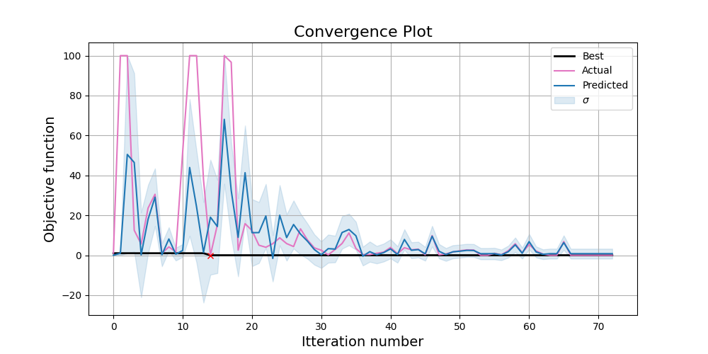

# Development example

This example is aimed at people who want to help develop this library, either by adding new optimisers
or extending existing optimisers! This is also demonstrates how the intergration tests are implemented in this
repository.

A major issue with optimising monte carlo sims is that they are very slow. This can make development and testing very 
painful! For this reason, we have included functionality where one can call a 'Topas Emulator'. Basically this
is just a function that does nothing, allowing you to test your optimisation algorithm on [the rosenbrock function](https://en.wikipedia.org/wiki/Rosenbrock_function),
which is a very commonly used function to test optimisers, and has a known global minimum.

This example demonstrates this process.

## Set up base directory

You will want to set up your base directory in a same way that you did in the other examples. The key difference is:

- GenerateTopasScripts code do nothing, and can be almost empty  
- When you instantiate the optimser, you **must** set TopasLocation='testing_mode'.

GenerateTopasScripts:
```python
def GenerateTopasScripts(BaseDirectory, iteration, **variable_dict):
    return ['dummy_script'], ['dummy_script']
```

TopasObjectiveFunction
```python
"""
This does nothing, it is just here to enable tests to run
"""
def TopasObjectiveFunction(ResultsLocation, iteration):
    return 0
```


## Limitations

This approach tests a lot of the code, but it doesn't test the users own code (GenerateTopasScripts and TopasObjectiveFunction).


## Results

Just for fun, here are the results of the currently implemented optimisers at optimising the rosebrock function: 





|                | **x** | **y** | **Itteration** |
| -------------- | ----- | ----- | -------------- |
| **NelderMead** | 0.95  | 0.95  | 95             |
| **Bayesian**   | 1     | 1     | 14             |

The ground truth value is x=1, y=1 - we can see that in this case the Bayesian optimser found the true ground truth on the 14th iteration. The NM never found it, but was steadily converging towards it and probably would have gotten there (or very close) with enough iterations. 
