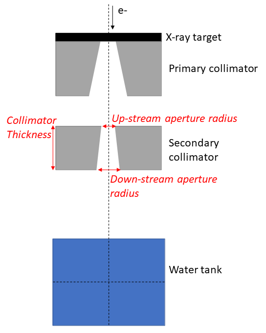

# Example 1: Geometry Optimisation

The starting point for an optimisation is a working topas model. In this example we are going to optimise the geometry of a simple x-ray collimator. We are going to randomise the values shown in read, and see if we can recover the correct values using the Bayesian optimisation. To guide the optimisation, we will create an objective function which simply measures the difference between the original depth dose curves and profile data and those created by a given set of parameters.

If you are an experienced python and topas user, you should allow 1-2 hours to set up this example (this will get much quicker once you get the hang of it; it takes me about 15 minutes). 

Actually running this example will take ~4 hours on a decent computer. 

## Base model and problem overview

In this example, we will optimise the geometry of an X-ray collimator. The geometry is shown below, with the parameters targeted for optimisation shown in red. The original values for each of these parameters are: Collimator Thickness = 54 mm, Up-stream aperture radius = 1.82 mm, and Down-stream aperture radius = 2.5 mm. In this example, each of these parameters will firt be assigned a random value. We will then attempt to recover the original values by constructing a simple objective function based on the differences between the original data and the current iteration.

You will need the data from the original simulation to complete this example; it is available [here](https://github.sydney.edu.au/Image-X/TopasBayesOpt/tree/master/examples/SimpleCollimatorExample_TopasFiles) 



## environment set up

If you need help with getting an appropriate environment set up properly, see HERE

## directory set up

To start with, create a folder somewhere called for instance 'ApertureOptExample' (or whatever). This is where you will store all the code necessary to run the optimisation. The rest of the instructions assume you are in this working directory.

When you have finished working through this example you should have a working directory which looks like this:


## Copy the base topas files

The code will need to know where your base model is stored. The base model for this application is available here: https://github.sydney.edu.au/Image-X/TopasBayesOpt/tree/master/examples/SimpleCollimatorExample_TopasFiles

https://downgit.github.io/#/home

Download these files into a folder inside your working directory (ApertureOptExample in this example).

Note that in principle these files can reside anywhere; we are going to put them inside the working directory to make this example as simple as possible!  

## Creating GenerateTopasScript.py

The first thing we will be needing is a function that generates your topas script.

Create a python file called 'temp_GenerateTopasScript.py' (or whatever you want, the name isn't important). Copy the below code into it (or use an interactive console if you prefer):

```python
import sys
sys.path.append('../../TopasBayesOpt')
from TopasBayesOpt.CreateRunTopasScript import CreateTopasScript
from pathlib import Path

this_directory = Path(__file__).parent

# nb: the order of input files is important to make sure that a phase space files are correctly classified
CreateTopasScript(this_directory, ['../SimpleCollimatorExample_TopasFiles/SimpleCollimator.tps',   '../SimpleCollimatorExample_TopasFiles/WaterTank.tps'])
# update these paths so that it points to wherever you have stored the base files

```

> **Tip:** CreateTopasScript is a code that takes a code and generates a code that generates a code. If that makes your head hurt you are not alone!

If it worked, you will now have a python function in your Optimisation Directory called GenerateTopasScript.py.

If you open this script up, you will see that all it has done it copied the contents of the topas file you input into a list, which it returns. At the moment, it's not very useful because every time it's called it will copy out exactly the same script! We will change that a bit later; but first it's a good idea to test this script and see if it actually works. 

To test it, run it directly. This will create two scripts in your working directory called SimpleCollimator.tps and WaterTank.tps. They should be almost identical to the input scripts. The differences are:

- **Include files:** if your original scripts contained any include statements, any included files are copied to ApertureOptExample/IncludeFiles. This is to ensure that this example will run even if you move it to a different server. This operation is recursive, i.e. include files of include files are also copied
- **Output files:** Any output file will now be appended with iteration, e.g. for iteration 7 the output files will be called OriginalOutputName_Itt_7
- **Input files:** When phase space sources are being used, it is a bit trickier to figure out what to do, since you could be using a static phase space source, or you could be using a phase space source which is generated in a previous sim.  CreateTopasScript will try to figure out which of these is occuring by checking if the input phase space is related to the output of a previous script. If the phase space is dynamic, its name will be updated using the same logic as above. If it is static,  we will  simply update the line to an absolute path. Note that unlike include files, we will not automatically create a local copy - this is because phase space files can be huge! 

>  **warning:** There are probably situations which CreateTopasScript does not handle well. For instance, CAD file imports are currently unsupported. In general, you should think of the script created at this point as a first draft. You may have to do some further work on it to get it to do exactly what you want. We will make some edits to GenerateTopasScripts.py a bit later on in this example. (You can delete temp_GenerateTopasScript.py now if you want to, it has done its job. )

## Creating RunOptimisation.py

Create a new file called RunOptimisation_main.py (or whatever you want, the name isn't important). Copy the below code into it:

```python
import sys
import os
import numpy as np
from pathlib import Path
sys.path.append('/mrlSSDfixed/Brendan/Dropbox (Sydney Uni)/Projects/TopasBayesOpt/TopasBayesOpt')
import TopasBayesOpt as to


BaseDirectory = os.path.expanduser("~") + '/Dropbox (Sydney Uni)/Projects/PhaserSims/topas'
# Update this! ^^^ This needs to be an existing location on your computer where you will store your sims
SimulationName = 'BayesianOptimisationTest' 
OptimisationDirectory = Path(__file__).parent  # points to whatever directory this script is in

# set up optimisation params:
optimisation_params = {}
optimisation_params['ParameterNames'] = ['UpStreamApertureRadius','DownStreamApertureRadius', 'CollimatorThickness']
# parameter names are just labels and can be called whatever you want, as long as they are used consistently
optimisation_params['UpperBounds'] = np.array([3, 3, 40])
optimisation_params['LowerBounds'] = np.array([1, 1, 10])
# generate a random starting point between our bounds: (it doesn't have to be random, this is just for demonstration purposes)
random_start_point = np.random.default_rng().uniform(optimisation_params['LowerBounds'], optimisation_params['UpperBounds'])
optimisation_params['start_point'] = random_start_point
optimisation_params['Nitterations'] = 40
# optimisation_params['Suggestions'] # you can suggest points to test if you want - we won't do this here here.
ReadMeText = 'This is a public service announcement, this is only a test'

Optimiser = to.BayesianOptimiser(optimisation_params, BaseDirectory, SimulationName, OptimisationDirectory,
                                 TopasLocation='~/topas37', ReadMeText=ReadMeText, Overwrite=True)
Optimiser.RunOptimisation()

```

A full list of the inputs for BayesianOptimiser is HERE, but the inputs we are using this case are described below:  

- **optimisation_params** is the dictionary of parameters we set up in this script
- **BaseDirectory** is where you want to store all your optimisations
- **SimulationName** this particular simulation will be stored at BaseDirectory / SimulationName
- **OptimisationDirectory** Is the directory where this script is located. In this example this is ApertureOptExample

- **ReadMeText** is an optional parameter where you can simply enter some text describing what the optimisation is supposed to be doing. this can be pretty useful when you come back to some case months later!
- **Overwrite=True** means that the optimiser will empty any files in BaseDirectory / SimulationName. If this option is False, the code will ask you first.
- **TopasLocation** is the path to your topas installation. If you followed the installation instructions, this will be at ~/topas, which is where the code will look by default. 

## Editing GenerateTopasScript.py

Remember from earlier that GenerateTopasScript.py currently regenerates the original topas scripts. For an optimisation, we need to be able to receive parameters from the optimiser, and build a model reflecting these parameters. Therefore we will have to make some changes to this script! 

Whenever GenerateTopasScript is called from the optimiser, it will be passed a dictionary that contains the variables defined in optimisation_params and their current values. We need to edit GenerateTopasScript so that when these parameters change, the topas parameters change accordingly. Firstly, we need to change three lines:

```python
# 1. change
SimpleCollimator.append('d:Ge/SecondaryCollimator/RMin2      = 1.82 mm')
# to
SimpleCollimator.append('d:Ge/SecondaryCollimator/RMin2      = ' + str(variable_dict['DownStreamApertureRadius']) + ' mm')

# 2. change
SimpleCollimator.append('d:Ge/SecondaryCollimator/RMin1      = 2.5 mm')
# to
SimpleCollimator.append('d:Ge/SecondaryCollimator/RMin1      = ' + str(variable_dict['UpStreamApertureRadius']) + ' mm')

# 3. change
SimpleCollimator.append('d:Ge/SecondaryCollimator/HL         = 27 mm')
# to
SimpleCollimator.append('d:Ge/SecondaryCollimator/HL      = ' + str(variable_dict['CollimatorThickness']) + ' mm')


```

Notice that we have used the same variable names that we set up RunOptimisation.py. These can be called anything you want, they just have to be used consistently. 

We will make a few more changes. The original files used 500000 primary particles which are split 1000 times in the target. The resultant phase space is scored just below the collimator, and recycled 200 times in the water tank simulation. This took around 1 hour to run on 16 multi threaded cores.

We don't actually need especially high quality data to guide the optimser, so I'm going to reduce the number of primary particles by a factor of 10:

```python
# change
SimpleCollimator.append('ic:So/Beam/NumberOfHistoriesInRun = 500000')
# to
SimpleCollimator.append('ic:So/Beam/NumberOfHistoriesInRun = 50000')
```

> **Hint** In many cases, it is desirable to simple check that the optimisation will run through a complete iteration before running anything computationally intensive. To test that, you could just change NumberOfHistoriesInRun to e.g. 100

>**Hint:** Figuring out the optimal trade-off between simulation time and simulation noise is something that can take quite a while to get right! It can be helpful to run the same simulation e.g. 10 times, and assess the variance in the objective function against the accuracy of the result you hope to obtain with the optimization. 

## Creating TopasObjectiveFunction.py

Finally, create a file called TopasObjectiveFunction.py. The name of this **does** matter! 

The only things this file **must** do is

1. Contain a function called TopasObjectiveFunction which:
   1. Receive two inptuts from the optimiser: the location of the results, and the current iteration
   2. Return a value for the objective function to the optimiser. 


A very simple example of a function which meets these requirements is below:

```python
import numpy as np

def TopasObjectiveFunction(ResultsLocation, iteration):
    return np.random.randn()
```

Of course, this is pretty useless as an objective function since it returns a random number that has 
nothing to do with the results! But it illustrates a very useful principle: all this function
has to do is take two parameters and return a number. You can do whatever you want in between.

A more sensible objective function must do a few more things:

- Read in the latest results,
- Extract some metrics from them
- Calculate an objective value based on those results. 

The actual objective function we will use in this example fulfills these criteria, and is copied below. Copy this code into TopasObjectiveFunction.py.

```python
import sys
import os
sys.path.append('../../TopasBayesOpt')
from WaterTankAnalyser import WaterTankData
import numpy as np

def CalculateObjectiveFunction(TopasResults):
    OriginalDataLoc = os.path.realpath('../SimpleCollimatorExample_TopasFiles/Results')
    File = 'WaterTank'
    OriginalResults = WaterTankData(OriginalDataLoc, File)

    # define the points we want to collect our profile at:
    Xpts = np.linspace(OriginalResults.x.min(), OriginalResults.x.max(), 100)  # profile over entire X range
    Ypts = np.zeros(Xpts.shape)
    Zpts = OriginalResults.PhantomSizeZ * np.ones(Xpts.shape)  # at the middle of the water tank

    OriginalProfile = OriginalResults.ExtractDataFromDoseCube(Xpts, Ypts, Zpts)
    OriginalProfileNorm = OriginalProfile * 100 / OriginalProfile.max()
    CurrentProfile = TopasResults.ExtractDataFromDoseCube(Xpts, Ypts, Zpts)
    CurrentProfileNorm = CurrentProfile * 100 / CurrentProfile.max()
    ProfileDifference = OriginalProfileNorm - CurrentProfileNorm

    # define the points we want to collect our DD at:
    Zpts = OriginalResults.z
    Xpts = np.zeros(Zpts.shape)
    Ypts = np.zeros(Zpts.shape)

    OriginalDepthDose = OriginalResults.ExtractDataFromDoseCube(Xpts, Ypts, Zpts)
    CurrentDepthDose = TopasResults.ExtractDataFromDoseCube(Xpts, Ypts, Zpts)
    OriginalDepthDoseNorm = OriginalDepthDose * 100 /np.max(OriginalDepthDose)
    CurrentDepthDoseNorm = CurrentDepthDose * 100 / np.max(CurrentDepthDose)
    DepthDoseDifference = OriginalDepthDoseNorm - CurrentDepthDoseNorm

    ObjectiveFunction = np.mean(abs(ProfileDifference)) + np.mean(abs(DepthDoseDifference))
    return ObjectiveFunction

def TopasObjectiveFunction(ResultsLocation, iteration):

    ResultsFile = ResultsLocation / f'WaterTank_itt_{iteration}.bin'
    path, file = os.path.split(ResultsLocation)
    TopasResults = WaterTankData(path, file)  # WaterTank data is built on topas2numpy
    OF = CalculateObjectiveFunction(TopasResults)
    return OF
```

This code can serve as a useful template for for developing your own objective functions, but as mentioned: your objective function can do anything you want, as long as it take the two parameters ResultsLocation and iteration and return a number.

The objective function we are using is simply the sum of the absolute differences between a profile at iso center and a depth dose curve.  Note that both the current and original data are normalised to account for the fact that different numbers of primary particles are being used. 

> **Hint:** if you want a guaranteed way to impress your friends and family, you can tell them that this is an L1 norm objective function

## Running the example

You now have all the building blocks in place to run this example. To do so, you simply need to run RunOptimisation_main.py:

```bash
# from a command window:
python3 RunOptimisation_main.py 
```

Note that although I have tried to make a relatively light weight example here, it still requires a substantial server to run on. I ran this example on a server with 16 multi-threaded CPUs and it took around 5 minutes per iteration. To complete 40 iterations therefore will take ~ 4 hours.

> **warning:** I have used very aggressive variance reduction in this example. Always be careful with [implementing variance reduction techniques](https://topas.readthedocs.io/en/latest/parameters/variance/index.html). 

## Interpreting the results

Ok, you've gone away and drunk several beers while the optimisation was running, and you are now ready to see how it did! 

Navigate to whatever you set up as BaseDirectory / SimulationName in your RunOptimisation script. An explanation of the folders you see here:

- **logs:** Contains log files from the optimisers and results from the optimisation.
  - **TopasLogs:** contains the output from each topas simulation that was run. If your topas sims ever crash, this is a good starting point to figure out why
  - **SingleParameterPlots:** This contains the estimate of how the objective function will change as a function of each parameter, assuming all other parameters are held at the (current) optimal value,
- **Results:** Contains the topas simulation outputs. By default it will contain the result of every simulation you ran. In some cases this will be a lot of unecessary data, and you can set ResultsToKeep = 'last' **CODE THIS**
- **TopasScripts:** Contains the scripts used to run each iteration.

To start with, have a look at ConvergencePlot.png, This will show you the actual and predicted value of the objective function at each iteration. Ideally, you should see that the predictions get better (better correlation) with more iterations. The best point found is marked with a red cross.

\Projects\PhaserSims\topas\BayesianOptimisationTest\logs\ConvergencePlot.png)

Next, open CorrelationPlot.png. This shows a scatter plot of the predicted versus actual objective function across all iterations. If the gaussian process model is working well, you should see reasonable correlation, and both correlation metrics should be < 0.5. 

> **Note:** the model doesn't have to be particularly accurate to be useful; it just has to correlate reasonably well with the true objective function

\Projects\PhaserSims\topas\BayesianOptimisationTest\logs\CorrelationPlot.png)

If the correlation isn't great, you could have a look at RetrospectiveModelFit.png. This plots what the model predicts **after** it has seen each point. If this also isn't working, you have a serious problem with the model, since predicting something that has already happened isn't very difficult!!

Take a look at the plots in logs/SingleParameterPlots. These plots show the gaussian process predicted objective function value as a function of each parameter, while the other parameters are held at their optimal value. Note that you should interpret these in the context of the correlation plot. If the correlation is high, then these should represent a reasonable accurate interpretation of how each parameter effects the objective function. If correlation is low, these are close to nonsense! 


In this case, the correlation values are reasonable, so we should be reasonably confident in these plots. This is also indicated by the fact that the models own estimate of uncertainty (indicated by the blue shading) is low.

Finally, open OptimisationLogs.txt and scroll to the bottom. This will tell you what the best guess for each parameter was.

After running this example for 40 iterations, I got the following results:

Itteration: 0, UpStreamApertureRadius:  1.06, DownStreamApertureRadius:  1.72, CollimatorThickness:  39.02, target_prediction_mean:  0.00, target_prediction_std:  0.00, ObjectiveFunction:  13.42

| Parameter                | Original Value | Random Starting Value | Recovered Value |
| ------------------------ | -------------- | --------------------- | --------------- |
| CollimatorThickness      | 27 mm          | 12.5 mm               | 26.0 mm         |
| UpStreamApertureRadius   | 1.82 mm        | 2.46 mm               | 1.9 mm          |
| DownStreamApertureRadius | 2.5 mm         | 1.62 mm               | 2.4 mm          |

This is pretty good! In just 40 iterations, we recovered the original values to within 5% of their original values. Compare this to a grid search approach: if we split each variable into 10, it would require 1000 iterations, and the spacing between solutions would still be larger than the accuracy obtained here.

If you require better accuracy, you have a few options:

- Run more iterations. See Restarting Optimisation
- Use these parameters as a starting guess, and run a new optimisation with a reduced search space
- Note that there **will** be noise in the objective function. This is an inherent aspect of the monte carlo method, especially when we are trying to run fast simulations. At some point, this noise will limit the accuracy the optimiser could even theoretically achieve. See assessing and handling noise in the objective function.


