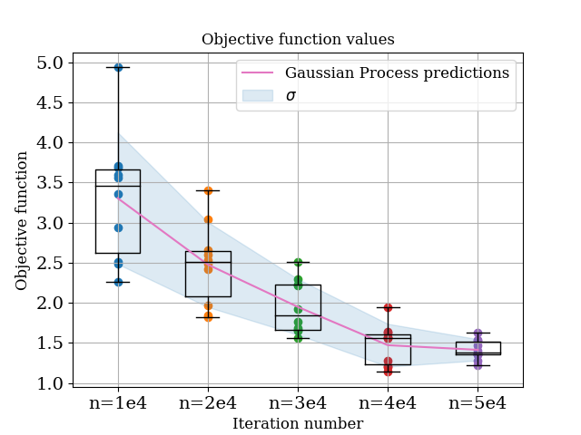
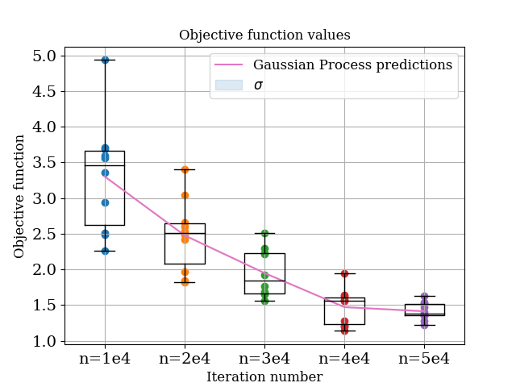
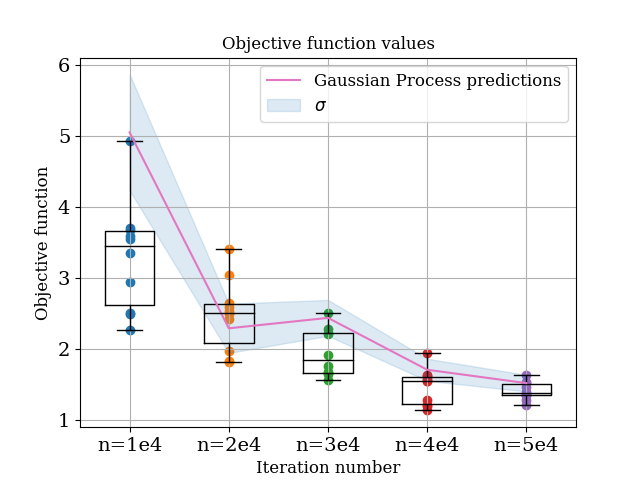
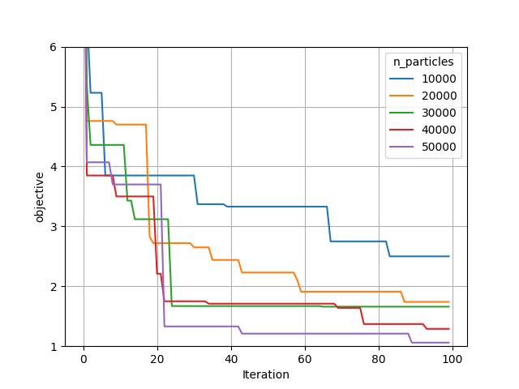

# Handling noisy data

In Monte Carlo modelling, we constantly have to trade off how long our simulations run for and how noisy they are. This is particularly important for TopasOpt, where total run time = time_per_sim * n_iterations.

In general, the easiest way to handle noise is to make sure it is low enough that you don't care about it. However, there will certainly be situations where this approach results in unacceptably long run times. Therefore, in this example we will look at working with noisy data using Bayesian Optimization.

This tutorial is split into the following sections:

- Quantifying statistical noise versus n_primary_particles by generating multiple identical simulations 
- modelling the noisy data with gaussian process models
- re-running TopasOpt with a custom kernel that accounts for noise

## Setup example

As always; start by setting up a new folder that will hold all the codes to run the example. 

This example is based on the same base code as the [geometry example](https://acrf-image-x-institute.github.io/TopasOpt/ApertureOptimisation.html). You should complete that example first. All of the source code for the steps below can be found [here](https://github.com/ACRF-Image-X-Institute/TopasOpt/tree/master/examples/NoisyOptimisation). 

## Generating simulations with different level of noise

In order to assess how statistical noise manifests in our objective function, we can generate N identical simulations, assess the objective function for each one, and quantify the variance. We can use our the `GenerateTopasScripts.py` function we [previously developed](https://acrf-image-x-institute.github.io/TopasOpt/ApertureOptimisation.html) to do this, so copy that one into your example directory. we will make some modifications so that we can also vary the number of primary particles. 

add the following lines inside the GenerateTopasScripts function:

```python
try:
    with open('particle_data.json', 'r') as fp:
        particle_data = json.load(fp)
        n_particles = particle_data['n_particles']
    except FileNotFoundError:
        raise FileNotFoundError('could not locate particle_data.json. Please create    									this file and place e.g. the following in it:'
                                '\n`{"n_particles": 50000}`')
```

This line of code will attempt to read in the number of particles from a file called particle_data.json, which we will create later.

Also change 

```python
#change:
SimpleCollimator.append('ic:So/Beam/NumberOfHistoriesInRun = 5000')
# to
SimpleCollimator.append(f'ic:So/Beam/NumberOfHistoriesInRun = {int(n_particles)}')
```

Next, create a new file called (for instance) `generate_identical_sims.py` and copy the below code into it:

```python
from GenerateTopasScripts import GenerateTopasScripts
import os
from pathlib import Path
from TopasOpt.utilities import generate_run_all_scripts_shell_script
import json


basedirectory = Path(os.path.expanduser('~')) / 'Documents' / 'temp' / 'noise_sims'
if not basedirectory.is_dir():
    basedirectory.mkdir()

n_sims_to_generate = range(10)
n_particles_to_investigate = [10000, 20000, 30000, 40000, 50000]

variable_dict = {'UpStreamApertureRadius': 1.82,
                 'DownStreamApertureRadius': 2.5,
                 'CollimatorThickness': 27}

for n_particles in n_particles_to_investigate:
    particle_data = {}
    particle_data['n_particles'] = n_particles
    with open('particle_data.json', 'w') as fp:
        json.dump(particle_data, fp)  # GenerateTopasScripts will read this
    sim_directory = basedirectory / f'n_particles_{n_particles}'
    if not sim_directory.is_dir():
        sim_directory.mkdir()
    if not (sim_directory / 'Results').is_dir():
        (sim_directory / 'Results').mkdir()
    if not (sim_directory / 'logs').is_dir():
        (sim_directory / 'logs').mkdir()
    if not (sim_directory / 'scripts').is_dir():
        (sim_directory / 'scripts').mkdir()
    sim_num = 0
    variable_dict['n_primaries'] = n_particles
    ScriptsToRun = []
    for n_sim in n_sims_to_generate:
        [SimpleCollimator, WaterTank], [sim1_name, sim2_name] = GenerateTopasScripts('gah', n_sim, **variable_dict)
        sim_num += 1
        sim1 = sim_directory / 'scripts' / (sim1_name + '_' + str(sim_num) + '.tps')
        sim2 = sim_directory / 'scripts' / (sim2_name + '_' + str(sim_num) + '.tps')
        ScriptsToRun.append(sim1)
        ScriptsToRun.append(sim2)
        # write the first simulation
        f = open(sim1, 'w')
        for line in SimpleCollimator:
            f.write(line)
            f.write('\n')
        # write the second simulation
        f = open(sim2, 'w')
        for line in WaterTank:
            f.write(line)
            f.write('\n')
    # once all sims are generated, write a 'RunAllFiles.sh' script:
    generate_run_all_scripts_shell_script((sim_directory / 'scripts'), ScriptsToRun)
```

As the name implies, this script will generate N identical simulations, for varying number of primary parrticles. In addition, we are looping over the n_particles parameter so we can also assess the effect of this on noise.

>  you may have to update the `basedirectory` parameter for your system to a location that actually exists!

Running this script will generate a series of folders called n_particles_{some_number}. Inside each folder is a directory called scripts, which contains a shell file called `RunAllFiles.sh`. As the name implies, this will run all scripts in the folder. If you wanted to run everything in one go, you could also create a bash script to run all of these sequentially, e.g:

```bash
#!/bin/bash
cd n_particles_20000/scripts/
./RunAllFiles.sh
cd ../..
cd n_particles_40000/scripts/
./RunAllFiles.sh
cd ../..
cd n_particles_50000/scripts
./RunAllFiles.sh
cd ../..
cd n_particles_500000/scripts
./RunAllFiles.sh
cd ../..
```

You can go ahead and generate results locally if you want, but it is somewhat time consuming, so if you want you can just [download the pre-run results](https://cloudstor.aarnet.edu.au/plus/s/7X2fwap7iIvC71O) and continue...

## Set up a plotting function

Create a new file called `noise_box_plots.py` and copy the below into it. We will use this function in the following steps.

```python
import numpy as np
from matplotlib import pyplot as plt

def plot_gp_model_versus_data(BoxPlotData, target_predictions, std_predictions):
    figure, axs = plt.subplots()

    try:
        axs.boxplot(BoxPlotData, labels=['n=1e4', 'n=2e4', 'n=3e4',
                                         'n=4e4', 'n=5e4'],
                    medianprops={'color': 'k'})
    except ValueError:
        print(f'couldnt label boxplots, label length didnt match data')
        axs.boxplot(BoxPlotData, medianprops={'color': 'k'})

    for i, data in enumerate(BoxPlotData.T):
        axs.scatter(np.ones(np.shape(data)[0]) * i + 1, data)
    axs.set_ylabel('OF')
    axs.set_title('Objective function values')

    # now add the predictions
    x_vals = np.arange(1, std_predictions.shape[0]+1)
    line1 = axs.plot(x_vals, -1*target_predictions, 'C6')
    axs.set_xlabel('Iteration number', fontsize=12)
    axs.set_ylabel('Objective function', fontsize=12)
    line2 = axs.fill_between(x_vals, -1*target_predictions + std_predictions,
                     -1*target_predictions - std_predictions, alpha=0.15, color='C0')
    axs.legend([line1[0], line2], ['Gaussian Process predictions', r'$\sigma$'], fontsize=12)
    axs.grid()
    plt.show()
```

## Assessing noise in the objective function

Now that we have the results (either because you generated them yourself or you downloaded the data) we can assess how the effect the objective function. Create a new script called e.g. `quantify_noise.py` and copy the below into it.

```python
import numpy as np
from pathlib import Path
from TopasObjectiveFunction import TopasObjectiveFunction
from TopasOpt.utilities import get_all_files
from bayes_opt import BayesianOptimization
from bayes_opt import UtilityFunction
from noise_box_plots import plot_gp_model_versus_data
from sklearn.gaussian_process.kernels import Matern, WhiteKernel

data_dir = Path(r'/home/brendan/Downloads/noise_sims') # where is the previously generated (or downloaded) data
OptimisationDirectory = Path(__file__).parent  # dont change

# set up optimisation params (this is necessary to instantiate the optimizer, we don't actually use them):
optimisation_params = {}
optimisation_params['ParameterNames'] = ['UpStreamApertureRadius', 'DownStreamApertureRadius', 'CollimatorThickness']
optimisation_params['UpperBounds'] = np.array([3, 3, 40])
optimisation_params['LowerBounds'] = np.array([1, 1, 10])
optimisation_params['start_point'] = np.array([1.14, 1.73, 39.9])
optimisation_params['Nitterations'] = 40
k1 = Matern(length_scale=[3, 0.2, 0.2])
k2 = WhiteKernel()
custom_kernel = k1 + k2
target_predictions = []
std_predictions = []

# generate pbounds
pbounds = {}
parameter_values = {}
for i, ParamName in enumerate(optimisation_params['ParameterNames']):
    pbounds[ParamName] = (optimisation_params['LowerBounds'][i], optimisation_params['UpperBounds'][i])
    parameter_values[ParamName] = optimisation_params['start_point'][i]


sims_to_investigate = ['n_particles_10000', 'n_particles_20000', 'n_particles_30000', 'n_particles_40000', 'n_particles_50000']
of_results = [[] for _ in range(len(sims_to_investigate))]
j = 0
for sim in sims_to_investigate:
    data_loc = data_dir / sim / 'Results'
    results = get_all_files(data_loc, 'bin')
    iteration = 0
    utility = UtilityFunction(kind="ucb", kappa=2.5, xi=0.0)
    optimizer = BayesianOptimization(f=None,pbounds=pbounds,  verbose=2, random_state=1)
    optimizer.set_gp_params(kernel=custom_kernel)
    for result in results:
        objective_value = TopasObjectiveFunction(data_loc, iteration, take_abs=True)
        # note we added a new parameter so we aren't automatically taking absolute values
        of_results[j].append(objective_value)
        iteration += 1
        optimizer.register(params=parameter_values, target=objective_value)
    # because we are running this in a pretty weird way we have to manually fit the model:
    optimizer._gp.fit(optimizer._space.params, optimizer._space.target)
    # generate gaussian prediction
    optimal_params = dict(sorted(parameter_values.items()))  # make sure they are in alphabetical order
    param_array = np.fromiter(optimal_params.values(), dtype=float)
    predicted_target, predicted_std = optimizer._gp.predict(param_array.reshape(1, -1), return_std=True)
    target_predictions.append(-1*predicted_target)
    std_predictions.append(predicted_std)
    j = j+1
    del optimizer

of_results = np.array(of_results)
of_results = of_results.T
plot_gp_model_versus_data(of_results,  np.array(target_predictions).squeeze(), np.array(std_predictions).squeeze())

```

This script will attempt to call `TopasObjectiveFunction`, so copy the [TopasObjectiveFunction from the geometry optimisation example](https://github.com/ACRF-Image-X-Institute/TopasOpt/tree/master/examples/ApertureOptimisation) into your working directory. As discussed in the notes for that example, you need to update this function such that it points to wherever your ground truth results are stored:

```python
# change
GroundTruthDataPath = str(Path(__file__).parent / 'SimpleCollimatorExample_TopasFiles' / 'Results')
# to wherever your ground truth results are
```

Remember you can also [download the ground truth results](https://cloudstor.aarnet.edu.au/plus/s/Wm9vndV47u941JU)

Ok, now we can run `quantify_noise.py`, which will produce the following results:



From this, we observe the following:

1. In general, the gaussian process model is doing an excellent job modelling the noise. Note that at this point we are only asking the model to predict values which it has a lot of data for - so it **should** work well, but it's reassuring that it does!
2. Noise in the objective function decreases with increasing number of particles. This is not surprising!
3. Mean value of the objective function increases as noise increases. This perhaps is more surprising, and goes back to the fact that we are taking absolute differences in the objective function, therefore any noise manifests as an increased value of the objective function.

The key step in this process was the construction of a custom kernel:

```python
k1 = Matern(length_scale=[3, 0.2, 0.2])
k2 = WhiteKernel()
custom_kernel = k1 + k2
```

The [WhiteKernel is used for modelling noise](https://scikit-learn.org/stable/modules/generated/sklearn.gaussian_process.kernels.WhiteKernel.html). We can also test what happens if we just use the defaul Matern kernel by not adding the white kernel

```python
custom_kernel = k1  # just the standard Matern kernel
```




In this case, the prediction basically defaults to the last point it has seen and the noise estimate is zero. So the construction of the appropriate kernel is key!

## Passing the newly constructed kernel to TopasOpt

So, we know we have a gaussian process model capable of modelling noise - at least under situation where it sees enough data. The next step is to test the effectiveness of the optimization using this gaussian process model. 

We are going to run the optimization repeatedly with a different number of primary particles. We are going to use the custom kernel developed in the previous section. The below run_optimisation script is almost identical the one we [used in the other example](https://acrf-image-x-institute.github.io/TopasOpt/ApertureOptimisation.html), except we pass a custom kernel. 

````python
import numpy as np
from pathlib import Path
from TopasOpt import Optimisers as to
from sklearn.gaussian_process.kernels import Matern, WhiteKernel
import json

BaseDirectory =  '/home/bwhelan/PhaserSims/topas/'

OptimisationDirectory = Path(__file__).parent

# set up optimisation params:
optimisation_params = {}
optimisation_params['ParameterNames'] = ['UpStreamApertureRadius','DownStreamApertureRadius', 'CollimatorThickness']
optimisation_params['UpperBounds'] = np.array([3, 3, 40])
optimisation_params['LowerBounds'] = np.array([1, 1, 10])
optimisation_params['start_point'] = np.array([1.14, 1.73, 39.9])
# true values are  [1.82, 2.5, 27]
optimisation_params['Nitterations'] = 100
ReadMeText = 'reducing the number of primary particles even further, no noise kernel'

k1 = Matern(length_scale=[3, 0.2, 0.2])
k2 = WhiteKernel()
custom_kernel = k1 + k2
for n_particles in [10e3, 20e3, 30e3, 40e3, 50e3]:
    # write the number of particles to a json file:
    particle_data = {}
    particle_data['n_particles'] = n_particles
    with open('particle_data.json', 'w') as fp:
        json.dump(particle_data, fp)
    # update simulation name:
    SimulationName = f'noisy_opt_n_particles_{int(n_particles)}'
    Optimiser = to.BayesianOptimiser(optimisation_params=optimisation_params, 	 BaseDirectory=BaseDirectory,
                                     SimulationName=SimulationName, OptimisationDirectory=OptimisationDirectory,
                                     TopasLocation='~/topas38', ReadMeText=ReadMeText, Overwrite=True, KeepAllResults=True,
                                     custom_kernel=custom_kernel)
    Optimiser.RunOptimisation()
````

## Assessing optimiser performance

There are two aspects to consider when considering the optimiser perofmrance:

1. Did the underlying gaussian process model do a good modelling the noise?
2. How was the convergence rate and overall performance of the optimizer in each case? 

For the first case, we can use the logs from the optimizer to 'retrain' a gaussian process model, and test the predictions of this optimiser.  We are in essence going to do the same thing as in the previous seciton, except in this case instead of the gaussian process model predicting the values of points it has already seen, we are going to be asking it to infer the values of points it (probably) hasn't seen! the code to do this is [here]() (I am going to stop pasting all the source code into this article, it is getting very clunky) and the resultant plot is below:

> Do this!



Comparing this to the case above, we can see that in most cases, the gaussian process model is performing well. For the n=1e4 case the mean prediction is a bit off, but it is still accurately predicting the amount of noise.

So the next question is how did the optimization actually perform. To assess this we can compare convergence between the different cases:




From this it can be seen that

- In general, higher number of primary particles is associated with both more rapid convergence, and lower values found overall
- Most cases have still converged reasonably well - again, the 1e4 case is substantially worse than the others. 

The below table shows the best values found be each optimizer:

| **Parameter**            | **Ground truth value** | **n=1e4** | **n=2e4** | **n=3e4** | **n=4e4** | **n=5e4** |
| ------------------------ | ---------------------- | --------- | --------- | --------- | --------- | --------- |
| **Collimator Thickness** | 27                     | 27.94     | 26.32     | 27.21     | 27.61     | 26.83     |
| **Upstream hole size**   | 1.82                   | 2.53      | 1.75      | 2.22      | 2.11      | 1.77      |
| **Downstream hole size** | 2.5                    | 2.29      | 2.55      | 2.29      | 2.37      | 2.53      |

In general, the most sensitive parameters in these simulations is collimator thickness. All cases recovered this paramaters to within 1 mm. However, larger errors were seen in the other parameters.


 
