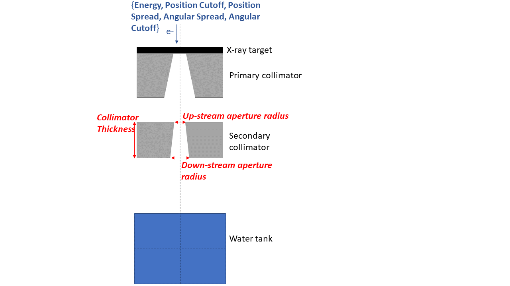
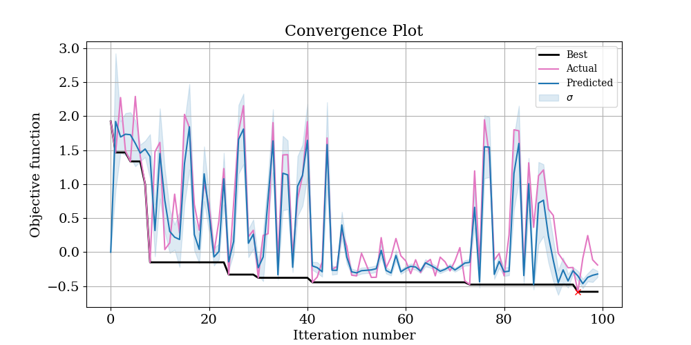
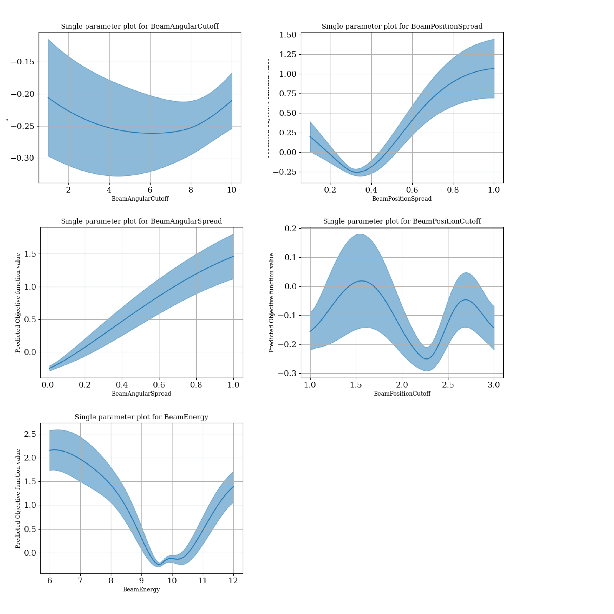
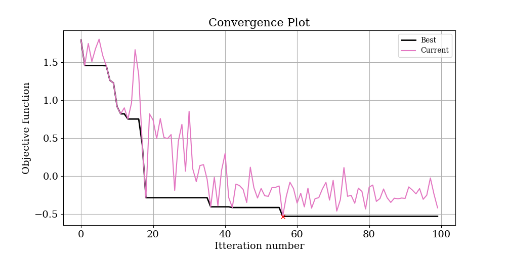
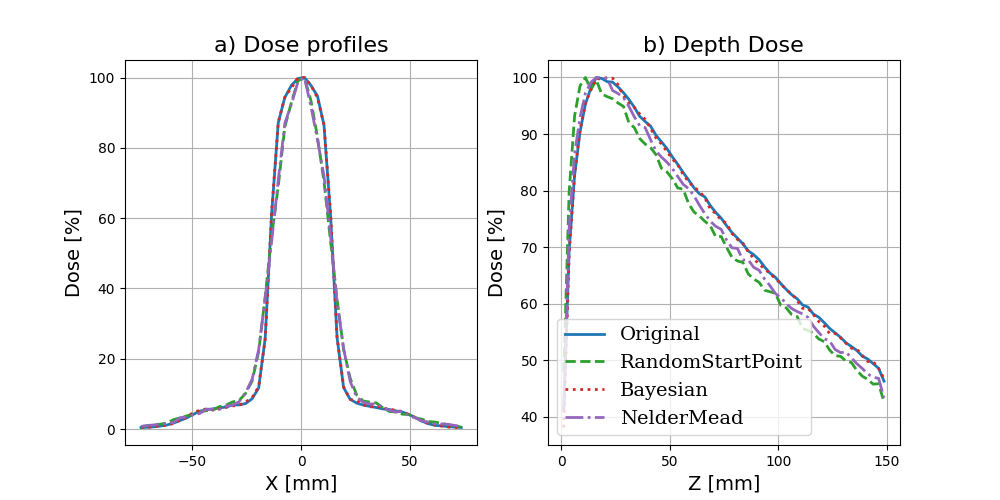

# Example 2: Phase space optimisation

> **Note:** in this example it is assumed you have already completed the [first example on Geometry optimisation](https://acrf-image-x-institute.github.io/TopasOpt/ApertureOptimisation.html).

In this example, we are going to optimise the same model as in example 1, but instead of optimising geometric parameters, we are going to optimize phase space parameters, shown in blue:



This is a much more difficult problem for several reasons:

- We will optimise five parameters simultaneously instead of three. 
- X-ray dose is actually pretty insensitive to the starting parameters of the electron beam used to produce it. This means we are going to have to do two things:
  - Be a bit smarter with our objective function
  - Run more iterations. This means it will take longer to run this optimization; allow ~16 hours on a 16 core machine.

## Directory set up

Since we are now running a new optimisation, you have to create a new base directory (you will repeat these basic steps every time you have an optimisation problem). So, create a new directory called e.g. PhaseSpaceOptimisation. The basic setup is the same as the ApertureOptimisation example.

## Creating GenerateTopasScript.py

This step is the same as in example 1; you should create your base line topas script as described in that example

## Creating RunOptimisation.py

The following is the script to run this optimisation. Remember to change the BaseDirectory to a place that exists on your computer!

```python
import sys
import os
import numpy as np
from pathlib import Path

from TopasOpt import Optimisers as to

BaseDirectory = os.path.expanduser("~") + '/Dropbox (Sydney Uni)/Projects/PhaserSims/topas'
SimulationName = 'PhaseSpaceOptimisationTest'
OptimisationDirectory = Path(__file__).parent

# set up optimisation params:
optimisation_params = {}
optimisation_params['ParameterNames'] = ['BeamEnergy', 'BeamPositionCutoff', 'BeamPositionSpread', 'BeamAngularSpread',
                                         'BeamAngularCutoff']
optimisation_params['UpperBounds'] = np.array([12, 3, 0.5, 0.15, 10])
optimisation_params['LowerBounds'] = np.array([6, 1, 0.1, .01, 1])
# generate a random starting point between our bounds (it doesn't have to be random, this is just for demonstration purposes)
random_start_point = np.random.default_rng().uniform(optimisation_params['LowerBounds'],
                                                     optimisation_params['UpperBounds'])
optimisation_params['start_point'] = random_start_point
optimisation_params['Nitterations'] = 100
# optimisation_params['Suggestions'] # you can suggest points to test if you want - we won't here.
ReadMeText = 'This is a public service announcement, this is only a test'

Optimiser = to.BayesianOptimiser(optimisation_params, BaseDirectory, SimulationName, OptimisationDirectory,
                                 TopasLocation='~/topas37', ReadMeText=ReadMeText, Overwrite=True)
Optimiser.RunOptimisation()
```


## Editing GenerateTopasScript.py

Just like last time, we have to edit our baseline script with the parameters that we want to optimise.

In order to reduce the total number of parameters we need to tune, we are going to make the assumption that our source is symmetric in x and y. Make the following changes to GenerateTopasScript.py:

```python
# change
SimpleCollimator.append('dc:So/Beam/BeamEnergy               = 10.0 MeV')
SimpleCollimator.append('dc:So/Beam/BeamPositionCutoffX = 2 mm')
SimpleCollimator.append('dc:So/Beam/BeamPositionCutoffY = 2 mm')
SimpleCollimator.append('dc:So/Beam/BeamPositionSpreadX = 0.3 mm')
SimpleCollimator.append('dc:So/Beam/BeamPositionSpreadY = 0.3 mm')
SimpleCollimator.append('dc:So/Beam/BeamAngularCutoffX = 5 deg')
SimpleCollimator.append('dc:So/Beam/BeamAngularCutoffY = 5 deg')
SimpleCollimator.append('dc:So/Beam/BeamAngularSpreadX = 0.07 deg')
SimpleCollimator.append('dc:So/Beam/BeamAngularSpreadY = 0.07 deg')
SimpleCollimator.append('ic:So/Beam/NumberOfHistoriesInRun = 500000')
# to
SimpleCollimator.append('dc:So/Beam/BeamEnergy               = ' + str(variable_dict['BeamEnergy']) + ' MeV')
SimpleCollimator.append('dc:So/Beam/BeamPositionCutoffX = ' + str(variable_dict['BeamPositionCutoff']) + ' mm')
SimpleCollimator.append('dc:So/Beam/BeamPositionCutoffY = ' + str(variable_dict['BeamPositionCutoff']) + ' mm')
SimpleCollimator.append('dc:So/Beam/BeamPositionSpreadX = ' + str(variable_dict['BeamPositionSpread']) + ' mm')
SimpleCollimator.append('dc:So/Beam/BeamPositionSpreadY = ' + str(variable_dict['BeamPositionSpread']) + ' mm')
SimpleCollimator.append('dc:So/Beam/BeamAngularCutoffX = ' + str(variable_dict['BeamPositionCutoff']) + ' deg')
SimpleCollimator.append('dc:So/Beam/BeamAngularCutoffY = ' + str(variable_dict['BeamPositionCutoff']) + ' deg')
SimpleCollimator.append('dc:So/Beam/BeamAngularSpreadX = ' + str(variable_dict['BeamAngularSpread']) + ' deg')
SimpleCollimator.append('dc:So/Beam/BeamAngularSpreadY = ' + str(variable_dict['BeamAngularSpread']) + ' deg')
SimpleCollimator.append('ic:So/Beam/NumberOfHistoriesInRun = 200000') # note we run more particles in this example because we are more sensitive to noise
```

## Create TopasObjectiveFunction.py

We need to create an objective function.

Since our basic problem is the same in example 1, we could in principle just copy and paste the objective function we used in that example. However, that objective function is actually pretty basic, and there are a few things we could change to make our lives easier.

- Place more emphasis on different parts of the dose cube - for instance, we know that the build up region in a depth dose curve tends to be quite sensitive to beam energy, so we could weight this part of the profile more heavily. We also know that that the penumbral region of a profile tends to be sensitive to the geometric properties of the electron beam, so we could weight these regions more heavily as well
- Because we expect the results aren't especially sensitive to the parameters we are optimising, we know we will be looking for small differences. Therefore, we could take the log of the objective function to emphasize the difference between small changes.

With these considerations in mind, I developed the below objective function. It's still based on assessing the differences between depth dose curves and profiles, but it has some different weightings thrown in and we take the log.

## Running the example

Note that there are many other beam parameters we could choose to include. 
We are going to keep this relatively simple by just having four optimization parameters

## Analyzing the results




Next, open up OptimisationLogs.txt, and scroll to the end; the best found solution is recorded:

```
Best parameter set: {'target': -0.5824966507848057, 'params': {'BeamAngularCutoff': 8.093521167768209, 'BeamAngularSpread': 0.01, 'BeamEnergy': 9.606637841613118, 'BeamPositionCutoff': 2.265724252124363, 'BeamPositionSpread': 0.309694887480956}}
```

These values are copied into the below table along with the ground truth values and the range we allowed them to vary over:

| Parameter          | Ground Truth | Allowed Range | Optimized |
| ------------------ | ------------ | ------------- | --------- |
| BeamEnergy         | 10           | 6-12          | 9.6 (4%)  |
| BeamPositionCutoff | 2            | 1-3           | 2.3 (15%) |
| BeamPositionSpread | 0.3          | .1-1          | .31 (3%)  |
| BeamAngularSpread  | .07          | .01-1         | .01 (86%) |
| BeamAngularCutoff  | 5            | 1-10          | 8.1 (62%) |

Our model actually seems to have done quite a good job!

Another thing that is interesting to look at can be found in the logs/SingleParameterPlots directly.

> **warning:** these plots show the value of the objective function predicted by the model. In the instances where the correlation between the predicted and actual objective functions is high, you can trust that these plots at least correlate with reality. But if the correlation is low, these plots are essentially nonsense.



These plots show the predicted change in the objective function as each single parameter is varied and all other parameters are held at their optimal value. From these plots, we can see that the most sensitive parameters seem to be BeamEnergy, BeamPositionSpread, and BeamAngularSpread. 

The worset parameter estimates are for BeamAngularSpread and BeamAngularCutoff. Looking at the plots above, BeamAngularCutoff is not predicted to be a very sensitive parameter anyway, so perhaps it is not surprising that the prediction is not very good. And while the percentage error in BeamAngularSpread  is large, the *absolute* error is very small - the true value is .01, and we found .07 in a range of 0-1. So this is actually pretty good too. 

## NelderMead Optimiser

Below is the convergence plot and results for the same problem solved with the Nelder Mead optimiser:



| Parameter          | Ground Truth | Allowed Range | Optimized |
| ------------------ | ------------ | ------------- | --------- |
| BeamEnergy         | 10           | 6-12          | 7.8       |
| BeamPositionCutoff | 2            | 1-3           | 2.7       |
| BeamPositionSpread | 0.3          | .1-1          | 1.0       |
| BeamAngularSpread  | .07          | .01-1         | 0.1       |
| BeamAngularCutoff  | 5            | 1-10          | 2.7       |

Like we have seen previously, the Nelder-Mead optimiser is completely outperformed by the Bayesian Optimiser. Nelder-Mead initially converges very quickly, but then is essentially 'stuck' in a set of parameters. 

## Comparing the results:

Maybe you want to take a look at how a given iteration has performed versus the ground truth data. We have a handy function that allows you to quickly produce simple plots comparing different results:

```python
from TopasOpt.utilities import compare_multiple_results

# update paths to point to wherever your results are.
ResultsToCompare = ['SimpleCollimatorExample_TopasFiles/Results/WaterTank.bin',
                    'C:/Users/Brendan/Dropbox (Sydney Uni)/Projects/PhaserSims/topas/PhaseSpaceOptimisationTest/Results/WaterTank_itt_0.bin',
                    'C:/Users/Brendan/Dropbox (Sydney Uni)/Projects/PhaserSims/topas/PhaseSpaceOptimisationTest/Results/WaterTank_itt_95.bin',
                    'C:/Users/Brendan/Dropbox (Sydney Uni)/Projects/PhaserSims/topas/PhaseSpaceOptimisationTest_NM/Results/WaterTank_itt_65.bin']

custom_legend = ['Original', 'RandomStartPoint', 'Bayesian', 'NelderMead']
compare_multiple_results(ResultsToCompare, custom_legend_names=custom_legend)

```

Comparing our best result with the ground truth yields the below plot:



- although our optimization didn't recover the exact parameters, the parameters it did select give a very good match to the ground truth
- The Bayesian solution looks substantially better than the NM solution, as we would expect based on how closely the parameters match the ground truth.
- We are in the realm where the noise in the data probably prevents us from finding a better match. If we really wanted to get a better estimate of these parameters, we probably have to run  a lot more particles. 
