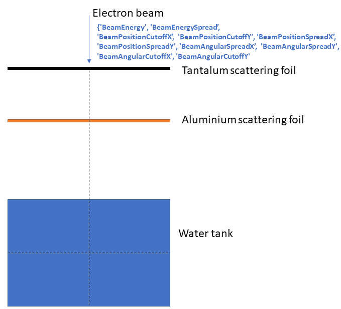

# Electron source optimization

this is a simulation of an electron beam hitting two scattering foils:



Note that in this example, we are not making any assumptions that the input beam is symmetric, meaning we are optimizing 10 independent parameters.  

## Environment set up

We assume that you have already set up an appropriate environment to run TopasOpt as described in example 1.

## Directory set up

Since we are now running a new optimisation, you have to create a new base directory (you will repeat these basic steps every time you have  an optimisation problem). So, create a new directory called e.g.  electron_source_optimisation.

## Generate sample data

from inside your base directory, download the topas file for this example:

```bash
wget https://raw.githubusercontent.com/ACRF-Image-X-Institute/TopasOpt/ebeam_example/examples/electron_source/SimpleBeam.tps
```

Following this you will have  a topas script called SimpleBeam.tps. Run it to generate the starting data:

```bash
~/topas/bin/topas SimpleBeam.tps
```

This will take a few minutes to run on a high end PC.

## Creating GenerateTopasScript.py

As previously: create a file called e.g. 'temp_make_topas_script_generator.py'. Copy the below code into it:

```python
import sys
from TopasOpt.TopasScriptGenerator import generate_topas_script_generator
from pathlib import Path

this_directory = Path(__file__).parent

# nb: the order is important to make sure that a phase space files are correctly classified
generate_topas_script_generator(this_directory, ['SimpleBeam.tps'])
```


